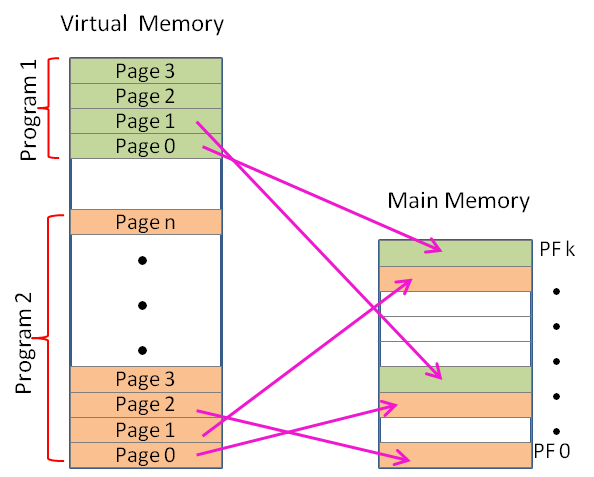
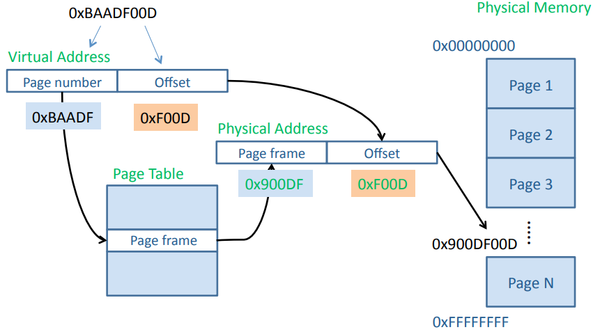
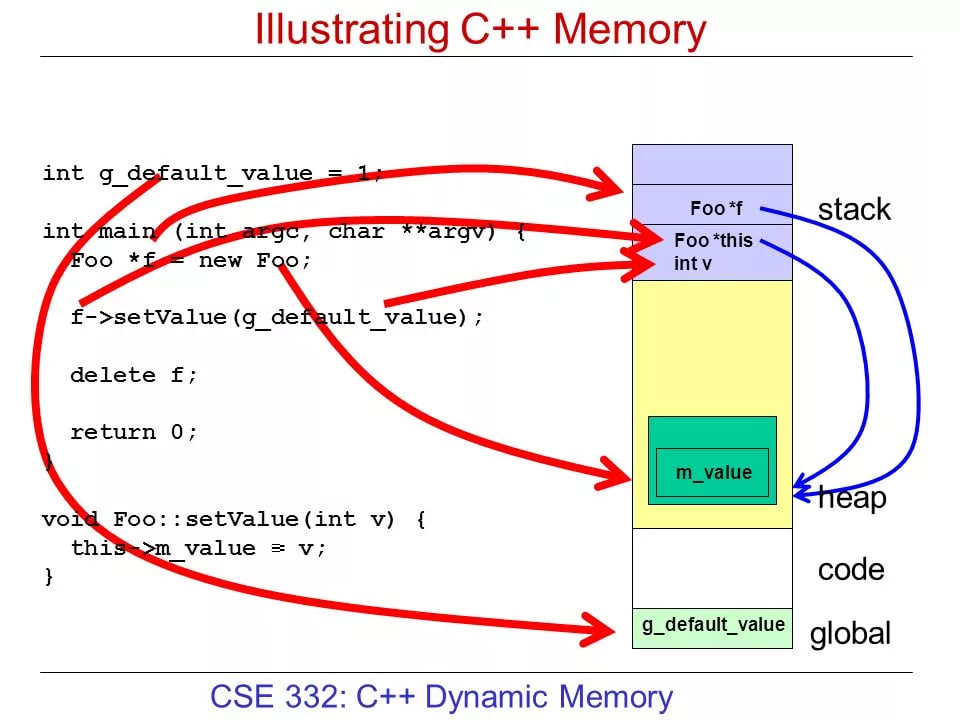
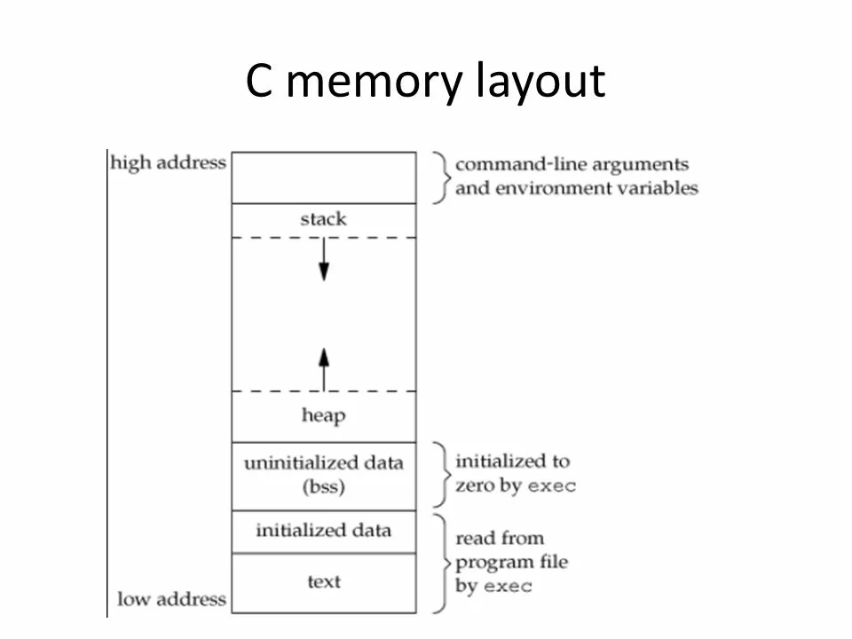
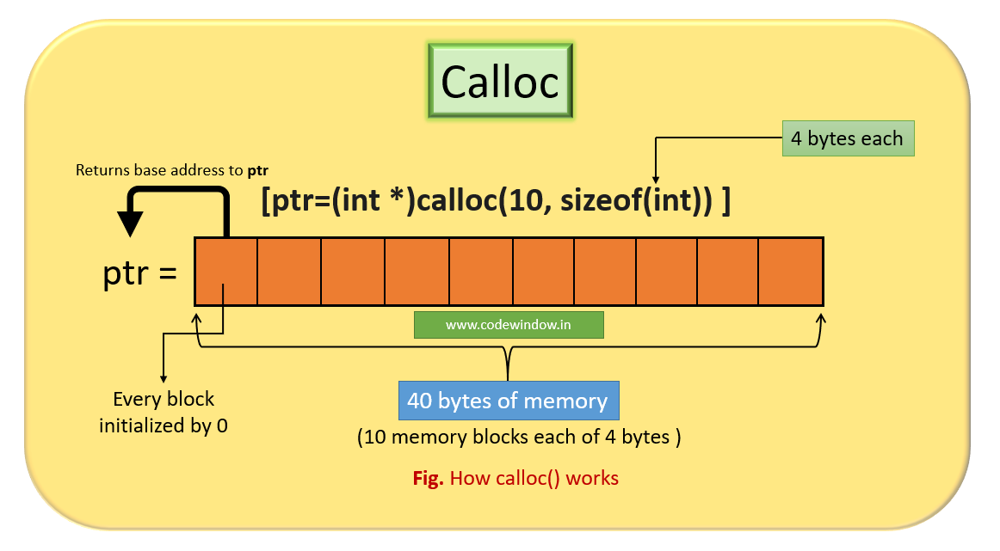

# Семинар 3

---

### Поговорим о памяти

* Какая бывает?
* Преимущества и недостатки
* Linux ate my RAM! http://linuxatemyram.com

---

### Виртуальная память



---

### Страничная память



---



---



---

### Прямая работа с памятью

```cpp
int *ptr = static_cast<int*>(malloc(sizeof(int) * kArraySize));

for (int idx = 0; idx < kArraySize; ++idx) {
  *ptr = idx;
  ++ptr;
}
```

* Что плохо в этом коде?

---

* free
* не потерять указатель на начало памяти
* bonus: откуда free понимает, сколько нужно освободить?

---



---

* new/delete
* new[]/delete[]

---

```
void * memcpy( void * dest, const void * src, size_t num );
```

* dest -- указатель на начало памяти в месте назначения
* src -- указатель на начало памяти источника
* num -- количество байт

---

```
void * memset( void * memptr, int val, size_t num );
```

* memptr -- нетипизированный указатель на начало памяти
* val -- значение для заполнения
* num -- количество байт, которое нужно заполнить

---

### С-строки

* std::string str;
* std::string_view str;
* const char *ptr = "Hello!";
* char arr[] = "Hello!";
* char str[]{ "string" };

---

* strcpy
* strlen
* strcmp

---

### Работа с аргументами

* смотреть примеры examples/arguments
