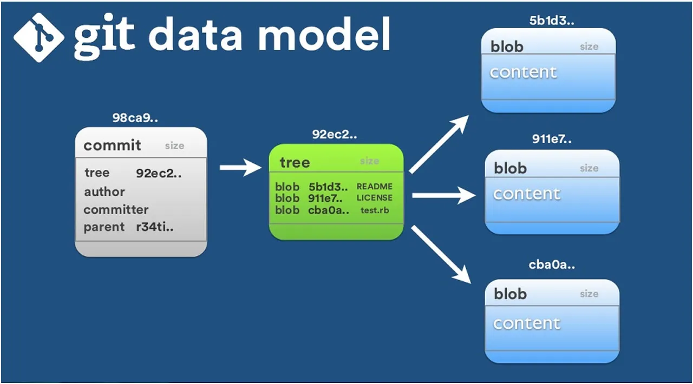
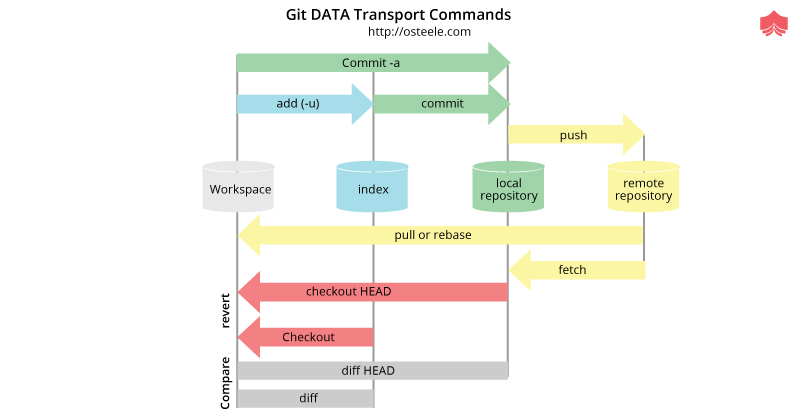

# Семинар 4

---

## VCS

* git, svn, cvs, mercurial - свободно распространяемые
* microsoft team studio - проприетарная
* не путать git, GitHub, bitbucket, GitLab

---

### Задачи, решаемые с помощью VCS

* совместная работа над кодом
* версионирование и история изменений

---

### Основные понятия

* репозиторий
* ветка
* коммит

---

## Основы работы с git

* Установить пакет в систему

---

### Регистрация и создание репозитория

* [Регистрация](https://gitlab.com/users/sign_in)
* [Новый проект](https://gitlab.com/projects/new#blank_project)

---

### Подключение к удаленному репозиторию

* Генерация ключей (публичный и приватный), `ssh-keygen`
* Добавление ключей в UI

---

### Подготовка к работе с репозиторием

```bash
git config --global user.name "epsilond1"
git config --global user.email "epsilond1@yandex.ru
```

---

* mkdir
* git init
* ls .git

---

* добавление удаленного репозитория

```bash
git remote [add|rm|show|] [local_name] [url ssh or https]
```

* просмотр репозиториев

```bash
git remote -v
```

---

* staging area
* tracked and untracked files

---

* git status
* git diff

---

* git branch
* git checkout -b <new branch>
* git checkout  [<branch_name> | <path>]
* git branch -D
* git branch -m

---

* git add
* git rm
* git commit -m "your very helpful message"
* .gitignore =)

---

### Локальное хранилище

* blobs (.git/objects)
* идентицируются 40-символьным хешем sha1
* содержимое сжимается zlib
* в одном blob хранится длина ассоциированного файла и пожатое содержимое

---



---

* граф (иерархия stagging area)
```
<права файла> <тип объекта> <sha1 объекта> <имя файла>
```

---

* дескриптор коммита
* хранит автора, временную метку, ссылку на tree-объект и родительский коммит

---

* diff
* в pack-файлах сохранены цепочки из объектов: самая новая версия (полное содержимое) и диффы к первому зафиксированному состоянию

---

* git push <local_name_repo>
* merge request (pull request)

---

* git pull <local_name_repo>

---

* git fetch

---



---

* git log
* git log --graph --oneline --decorate
* gitk (одноименный пакет)

---

### Алиасы

* git config --global alias.co checkout
* git config --global alias.br branch
* git config --global alias.ci commit
* git config --global alias.st status

---

* [Почитать](https://habr.com/ru/articles/174467/)
* [Еще почитать](https://habr.com/ru/companies/badoo/articles/163853/)
* [Практика](https://www.w3schools.com/git/exercise.asp?filename=exercise_getstarted1)

---
